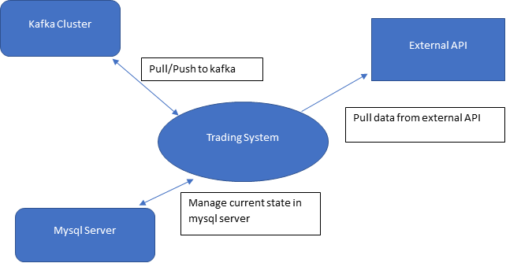

# Part 1: System Design and Architecture

    1. Architecture Overview:
        1. The system will consist of microservices for order management, market data, account management, risk management, and order execution. These will communicate via asynchronous message queues.
        2. Kafka will be used as the message broker to handle real-time data streams between microservices. Kafka provides low latency, high throughput, and data replication for fault tolerance.
        3. The microservices will be containerized using Docker and orchestrated on Kubernetes for easy deployment and scaling. Kubernetes also enables high availability through features like auto-restart and replication. 
        4. The system will utilize a cloud-based infrastructure on AWS to leverage auto-scaling groups and load balancing to ensure high availability and zero downtime.
        
    2. Microservices and Data Flow:
        1. The market data microservice will subscribe to exchange APIs and websockets to ingest real-time trade and order book data.
        2. It will publish this data to Kafka topics which will be consumed by the order management and risk management services
        3. Kafka helps decouple the data producers and consumers, allowing for distributed deployments and retry mechanisms for fault tolerance.
        4. The market data service can scale horizontally to handle high data loads across regions.
       
    3. Security and Data Protection:
        1. Access control will be implemented using OAuth for authentication and role-based authorization.
        2. Sensitive data like API keys will be stored encrypted at rest using AWS KMS. Access will be tightly controlled.
        3. Investor account data will be encrypted in transit and at rest in the database. Proper partitioning will be used to enforce data isolation between accounts.
        4. Communication between microservices will be encrypted using mTLS. API gateways will be used to enforce authentication and rate limiting

   

# Part 2 Technical Implementation:
    
    Current implementation:
        1. The trading system will run in standalone mode either using docker-compose or kubernetes. which continuesly pulls data from the external API and push to kafka for further processing.
        2. we save the state of the trading system in mysql in case if the systems goes down we have to restart from the same offset where system crashed or shutdown. 
        3. The state management will help us in multiprocessing environment if in case we want to run multiple server to fetch data from API.
        4. For processing the data we can have either process data and then push to the kafka or first push to the kafka and then consume from kafka for further processing. 
        
    
    1. Backend Development (Python):
        1. Focused on simplicity, modularity, and low coupling between components.
        2. Leverages asyncio for efficient execution.
        3. Clear Variable and function names which aids in readability and understanding the codebase.
        4. The code is straightforward and easy to understand, with each function focused on a single task
        5. Complex logic is broken down into smaller, manageable functions, promoting readability and maintainability.
        6. Each class and function has a single responsibility, such as fetching data from the API This makes it easier to understand, test, and maintain each component independently.
        7. Reusable code segments are encapsulated into functions or classes, reducing duplication.
        8. Each class and function has a single responsibility, adhering to the SRP.
        

    2. Testing Strategy:
        1. Unit tests with pytest to validate logic and edge cases
        2. We create test cases for both successful and failed API calls
        3. We use AsyncMock to mock asynchronous methods, allowing us to mock the behavior of the fetch method in CandleDataFetcher
        4. We use patch.object to patch the fetch method with the mocked behavior, ensuring that the actual API call is not made during testing.
        5. We assert that the data returned by fetch_candle_data matches the expected data in the successful test case
        6. We assert that the correct exception is raised in the failed test case.
        7. Verifying that data flows correctly from data fetching trade execution

    3. Concurrency and Parallelism:
        1. Asyncio used for asynchronous networking and parallel execution.
        2. Inter-process synchronization using queues.
        
    4. Cloud and CI/CD:
        1. Microservices containerized with Docker for portability
        2. Kubernetes used for container orchestration and deployment
        3. Horizontal scaling of microservices using Kubernetes 

# part 3 Case Study and Problem-Solving:

    1. Algorithms Optimization:
        1. Identify Performance Bottlenecks: 
            Use profiling tools to identify performance bottlenecks in the order execution process. This includes analyzing the latency introduced by various components such as data fetching, signal generation, order processing, and network communication

        2. Benchmarking:
               Measure the latency of each component individually and identify the critical path that contributes the most to overall latency. Benchmarking involves running stress tests and simulations to measure system performance under various load conditions. 

        3. Optimization Strategies:
            1. Reduce Network Latency: 
               Minimize network latency by colocating servers with exchanges or using high-speed direct market access (DMA) connections
            2. Algorithmic Optimization: 
               mplement efficient algorithms and data structures to reduce computational complexity and improve processing speed. For example, using data streaming and parallel processing techniques to handle large volumes of data more efficiently.
            3. Hardware Optimization: 
               Utilize specialized hardware such as graphics processing units (GPUs) for computationally intensive tasks.
            4. Memory Management: 
               Optimize memory usage and access patterns to minimize cache misses and improve data locality.
            5. Asynchronous Processing: 
               Implement asynchronous processing to overlap computation with I/O operations and reduce idle time.
            6. Precomputing:     
               Precompute and cache frequently used data to avoid redundant computations. 
            7. Tradeoff Analysis: 
               Analyze tradeoffs between performance, reliability, and security to determine the optimal balance for the trading system.
            
    2. Innovative Features:

        Technical Feasibility:
            Implementing real-time market depth visualization involves integrating with the exchange's API to retrieve and process order book data. This data can then be displayed in a user-friendly format within the trading algorithm's interface. Websockets are well-suited for real-time data streaming, making them an ideal choice for retrieving and updating market depth information.
        
        1. Use REST API as source of truth for account balances, positions, etc.
        2. Use Websocket for real-time order book and trade data
        3. Reduces slippage from delays in REST calls for critical account data
        4. Provides strongly consistent view of account state compared to websockets 
        5. Enables efficient scaling of market data component without compromising reliability
        6. Overall, this hybrid approach provides strong consistency, scalability, and low latency - improving reliability and precision of the trading system. 
        7. Data Retrieval: Utilize the exchange's API, preferably through websockets, to retrieve real-time order book data
        8. Data Processing: Process the retrieved order book data to extract relevant information such as bid-ask prices and order quantities.
        9. Visualization: Develop a user interface component to display the order book data in a visually intuitive manner, such as a depth chart or heatmap.
        10. Integration: Integrate the feature seamlessly into the existing trading algorithm framework. 
